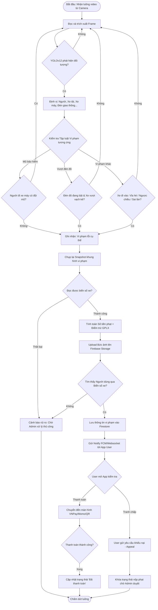

# Hệ thống Phạt Nguội Giao Thông (Traffic Violation Detection System)

Dựa trên việc phân tích toàn bộ mã nguồn và tài liệu của thư mục `"Violation Detect"` (trong đó bao gồm hệ thống **Python/FastAPI Backend** kết hợp mô hình AI YOLOv12 và ứng dụng **Mobile App Flutter**), hệ thống của bạn hoạt động theo một quy trình khép kín từ lúc camera bắt được hình ảnh cho đến lúc người dùng nộp phạt trên ứng dụng.

Dưới đây là chi tiết toàn bộ hệ thống bằng sơ đồ khối, lưu đồ thuật toán và giải thích lời văn.

---

## 1. Sơ đồ khối tổng thể (Block Diagram)

Sơ đồ dưới đây mô tả các thành phần (modules) chính của hệ thống và cách chúng tương tác với nhau:

```mermaid
graph TD
    subgraph Edge_Device [Thiết bị Đầu cuối]
        Cam[Camera Giao thông / Video Stream]
    end

    subgraph Backend_System [Detection Web Server - FastAPI & Python]
        YOLO[YOLOv12 Object Detection & Segmentation]
        CoreLogic[Hệ thống logic Vi phạm: Đèn đỏ, Ngược chiều, Mũ bảo hiểm...]
        OCR[Nhận diện biển số - OCR]
        LocalStore[Lưu trữ Snapshot/Video nội bộ]
        FirebaseAdmin[Firebase Admin SDK Sync]
    end

    subgraph Cloud_Services [Dịch vụ Đám mây - Firebase]
        Firestore[(Cơ sở dữ liệu Firestore)]
        FBStorage[Firebase Storage: Lưu trữ Ảnh]
        FCM[Firebase Cloud Messaging: Gửi Push Notification]
    end

    subgraph Mobile_App [Mobile App - Flutter]
        AppUI[Giao diện Quản lý vi phạm & Hồ sơ]
        Payment[Cổng thanh toán: VNPay / Momo / VietQR]
    end

    Cam -- "Truyền Video/Frame liên tục" --> YOLO
    YOLO -- "Tọa độ Bounding Box, Segmentation" --> CoreLogic
    CoreLogic -- "Tính toán theo luật giao thông" --> OCR
    OCR -- "Biển số xe / Bằng chứng" --> FirebaseAdmin
    CoreLogic -- "Lưu hình ảnh cắt ra" --> LocalStore
    
    FirebaseAdmin -- "Upload hình vi phạm" --> FBStorage
    FirebaseAdmin -- "Tạo Record Vi phạm + Trừ điểm" --> Firestore
    FirebaseAdmin -- "Kích hoạt cảnh báo tới thiết bị" --> FCM
    
    FCM -- "Push Notification (Realtime)" --> AppUI
    Firestore <--> "Đồng bộ dữ liệu"
    AppUI
    
    AppUI -- "Xác nhận nộp phạt" --> Payment
    Payment -- "Webhook Callback cập nhật trạng thái" --> Firestore
```

---

## 2. Lưu đồ thuật toán (Flowchart If-Else)

Phần này đặc tả luồng xử lý thuật toán phát hiện vi phạm thực tế từ Camera đến khi xử lý thanh toán:



---

## 3. Giải thích hệ thống chi tiết bằng lời văn

Toàn bộ hệ thống được chia thành 3 trụ cột (Pillars) chính: **(1) Trí tuệ Nhân tạo & Server xử lý**, **(2) Đám mây & Cơ sở dữ liệu**, và **(3) Ứng dụng người dùng (Mobile App Flutter)**.

### Bước 1: Thu thập và Nhận diện bằng Trí tuệ nhân tạo (YOLO)
- Server Backend (được xây dựng bằng **FastAPI/Python**) kết nối với các camera luồng (từ RTSP, webcam hoặc file video có sẵn) chạy liên tục trên một cổng giao tiếp cục bộ.
- Server đẩy từng khung hình cắt từ video vào mô hình AI xử lý hình ảnh **YOLOv12**. YOLO làm nhiệm vụ phân vùng khung hình và xác định chính xác tọa độ giới hạn bằng hộp (Bounding Box) cho các đối tượng: xe gắn máy, người, ô tô, vạch kẻ đường, làn đường, biển báo, và đèn giao thông.

### Bước 2: Đánh giá Vi phạm (Luồng xử lý If-Else logic)
Từ các tọa độ AI trả về, các thư viện mã nguồn trong module `functions` sẽ dùng thuật toán hình học để lọc và kết luận vi phạm (Quy trình If-else):
- **Không đội mũ bảo hiểm (`helmet_violation.py`)**: Nếu tọa độ "người" đang nằm trên "xe máy", thuật toán kiểm tra vùng đầu có bị bao phủ bởi vùng nhận diện "mũ bảo hiểm" hay không. Nếu KHÔNG -> Phát hiện vi phạm.
- **Vượt đèn đỏ (`redlight_violation.py`)**: Hệ thống đọc trạng thái đèn giao thông từ khung hình (đỏ, vàng, xanh). Nếu đối tượng "đèn" là Đỏ, và có tín hiệu "bánh xe" trượt qua giới hạn "vạch dừng kẻ sẵn" -> Phát hiện vi phạm.
- Các vi phạm khác như đi lên vỉa hè (`sidewalk_violation`), đi sai làn đường (`wrong_lane_violation`), ngược chiều (`wrong_way_violation`), v.v., cũng sử dụng nguyên tắc kiểm tra va chạm vùng cấm tương tự nhưng với các quy ước phạt mặc định. 

### Bước 3: Đồng bộ và Lưu bằng chứng (Backend to Firebase/Cloud)
- Ngay khi có vi phạm bị bắt lỗi, Server sẽ đóng băng khung hình (Snapshot) và cắt phần ảnh phương tiện vi phạm ra. Hệ thống sẽ tích hợp giải thuật **OCR** (Nhận diện ký tự quang học) nhằm "đọc" biển số xe để quy trách nhiệm.
- Module hệ thống lưu các bức ảnh chụp này vào thư mục nội bộ ổ cứng, đồng thời cũng upload nó lên kho đám mây **Firebase Storage** nhằm mục đích lấy link truy cập phân phối công khai cho người bị hại.
- Sau đó, hệ thống truy vấn cơ sở dữ liệu `Vehicles` xem bằng chứng biển số trên gắn liền với chủ tài khoản (User) nào. Nếu có đối khớp hoàn hảo, nó sẽ ghi trực tiếp bản ghi tội trạng tương ứng vào **Firebase Firestore** để lưu vết làm cơ sở pháp lý.

### Bước 4: Đẩy thông báo (Push Notifications & Websocket)
- Ngay tại khoảnh khắc lưu xong bằng chứng vi phạm ở Firestore, thông qua thư viện `FCMService`, Server sẽ gửi lệnh đẩy **FCM (Firebase Cloud Messaging)** hoặc **WebSockets**. Lệnh này sẽ bật thành một thông báo Notification trực tiếp lên màn hình điện thoại di động người dùng với dạng: *"Phương tiện mang biển số XXX của bạn vừa xảy ra vi phạm, yêu cầu kiểm tra chi tiết!"*.

### Bước 5: Phản hồi từ Người dân (Trực tiếp qua App Mobile Flutter)
- **Kiểm tra vi phạm:** Người dùng bấm vào thông báo điện thoại và mở App Mobile. Tại màn hình hồ sơ vi phạm, người dùng xem lại được cụ thể lỗi, vị trí, giờ vi phạm, mức phạt phải đóng, và xem rõ ảnh chụp bằng chứng rành rọt. Hệ thống cũng thực hiện trừ điểm tự động bằng lái xe (ví dụ: Vượt đèn đỏ trừ ngay 3 điểm từ cột 12 điểm gốc).
- **Thanh toán nộp phạt trực tuyến:** Nếu người dùng chấp nhận lỗi, họ bấm Thanh toán phạt. Ứng dụng chuyển qua DeepLink dẫn vào các cổng thanh toán online (**VNPay, Momo, hoặc chuyển khoản VietQR**) lấy dữ liệu tĩnh của mã vi phạm. Giao dịch thành công, Webhook của cổng thanh toán sẽ tự động gõ API Firebase để cập nhật trạng thái hóa đơn về màu xanh **"Đã thanh toán"**.
- **Khiếu nại (Appeal):** Nếu thấy việc bị phạt tự động là oan (ví dụ xe cho mượn, biển bị làm giả, hoặc cấp cứu), người dân ấn nút khiếu nại (Appeal) đính kèm ảnh bằng chứng riêng. Vi phạm sẽ lập tức chuyển sang trạng thái "Bị khóa chờ Admin xử lý thủ công" (Locked/Pending Admin). Quá trình nộp phạt tạm thời bị đình chỉ cho đến khi cơ quan quản lý tra xét xong và đưa phán quyết cuối cùng.
