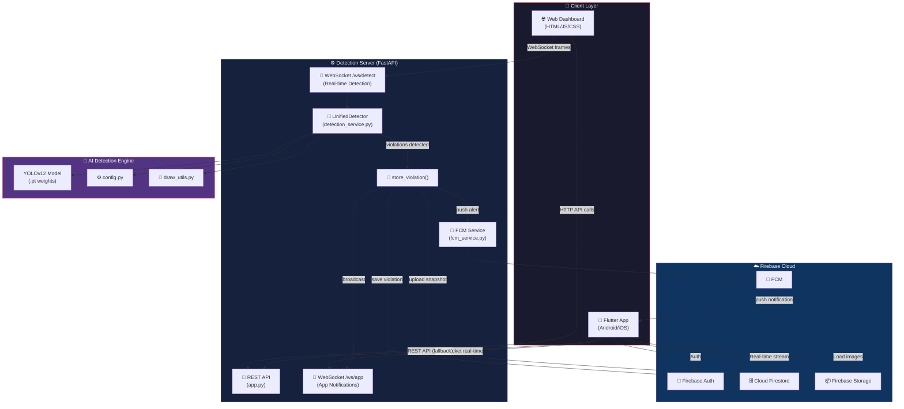
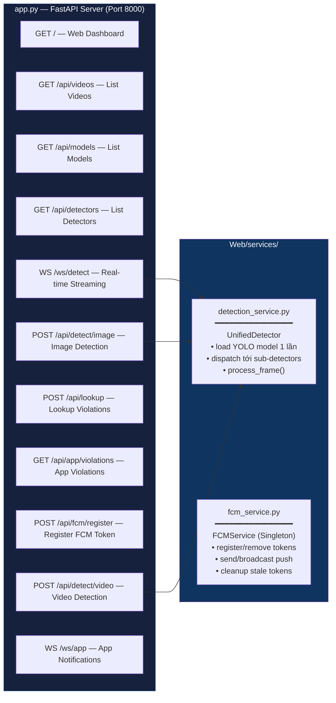
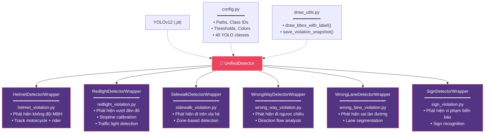
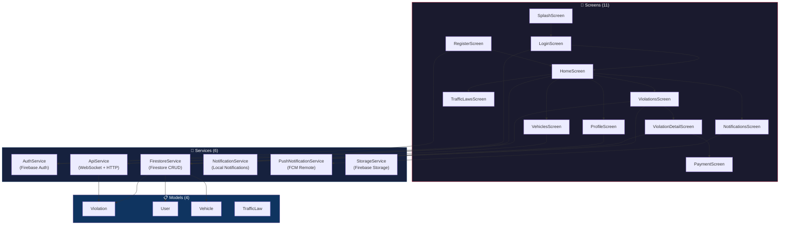
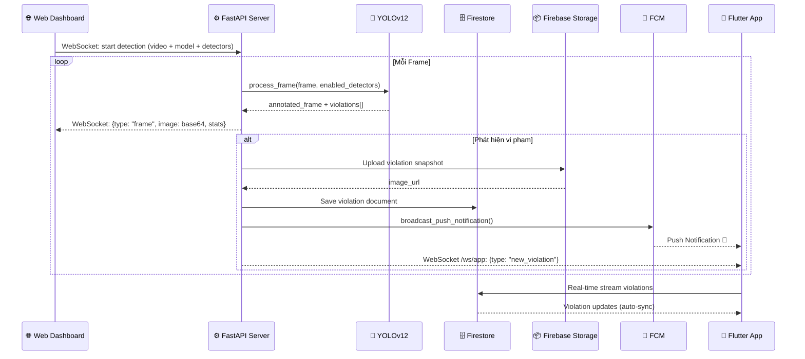
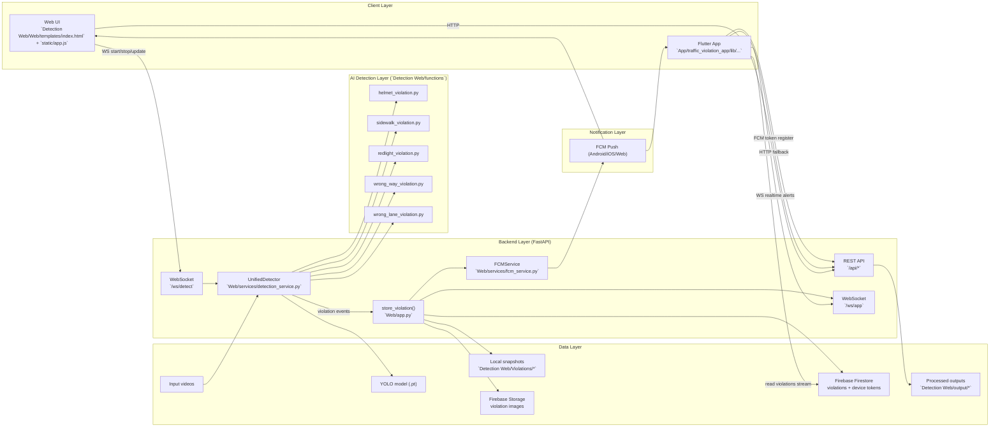

# 🏗️ Sơ Đồ Kiến Trúc Tổng Thể — Traffic Violation Detection System

## 1. Tổng Quan Hệ Thống

Hệ thống gồm **3 tầng chính**: Detection Server (Python/FastAPI), Firebase Cloud, và Flutter Mobile App.



---

## 2. Detection Server — Chi Tiết Backend



---

## 3. AI Detection Engine — 6 Violation Detectors



---

## 4. Flutter Mobile App — Chi Tiết Client



---

## 5. Luồng Dữ Liệu — Phát Hiện Vi Phạm



---

## 6. Cấu Trúc Thư Mục

```
Violation Detect/
├── Detection Web/                    # 🖥️ Server + Web UI
│   ├── Web/
│   │   ├── app.py                    # FastAPI server (1030 lines)
│   │   ├── services/
│   │   │   ├── detection_service.py  # UnifiedDetector (630 lines)
│   │   │   └── fcm_service.py        # FCM push service (360 lines)
│   │   ├── static/
│   │   │   ├── app.js                # Frontend JS
│   │   │   ├── style.css             # Frontend CSS
│   │   │   └── firebase-messaging-sw.js
│   │   ├── templates/index.html      # Web dashboard
│   │   └── serviceAccountKey.json    # Firebase credentials
│   ├── functions/                    # 🤖 6 Violation Detectors
│   │   ├── helmet_violation.py
│   │   ├── redlight_violation.py
│   │   ├── sidewalk_violation.py
│   │   ├── sign_violation.py
│   │   ├── wrong_lane_violation.py
│   │   └── wrong_way_violation.py
│   ├── config/config.py              # ⚙️ Centralized config (232 lines)
│   ├── utils/draw_utils.py           # 🎨 Drawing utilities
│   └── assets/                       # Model weights + test videos
│       ├── model/
│       ├── video/
│       └── image/
│
├── App/traffic_violation_app/        # 📱 Flutter Mobile App
│   └── lib/
│       ├── main.dart                 # App entry point
│       ├── screens/                  # 11 screens (UI)
│       ├── services/                 # 6 services (business logic)
│       ├── models/                   # 4 data models
│       ├── theme/                    # App theme
│       └── data/                     # Static data
│
└── Project info/                     # 📄 Documentation & prompts
```

---

## 7. Công Nghệ Sử Dụng

| Tầng | Công nghệ | Mô tả |
|------|-----------|-------|
| **AI/ML** | YOLOv12 + OpenCV | Object detection & tracking |
| **Backend** | FastAPI + Uvicorn | HTTP + WebSocket server |
| **Database** | Cloud Firestore | Real-time NoSQL database |
| **Storage** | Firebase Storage | Violation snapshot images |
| **Auth** | Firebase Auth | Email/password authentication |
| **Push** | Firebase Cloud Messaging | Push notifications (Android/iOS/Web) |
| **Mobile** | Flutter/Dart | Cross-platform mobile app |
| **Web UI** | HTML/JS/CSS | Detection monitoring dashboard |
| **Config** | Python (centralized) | 40 YOLO classes, paths, thresholds |


