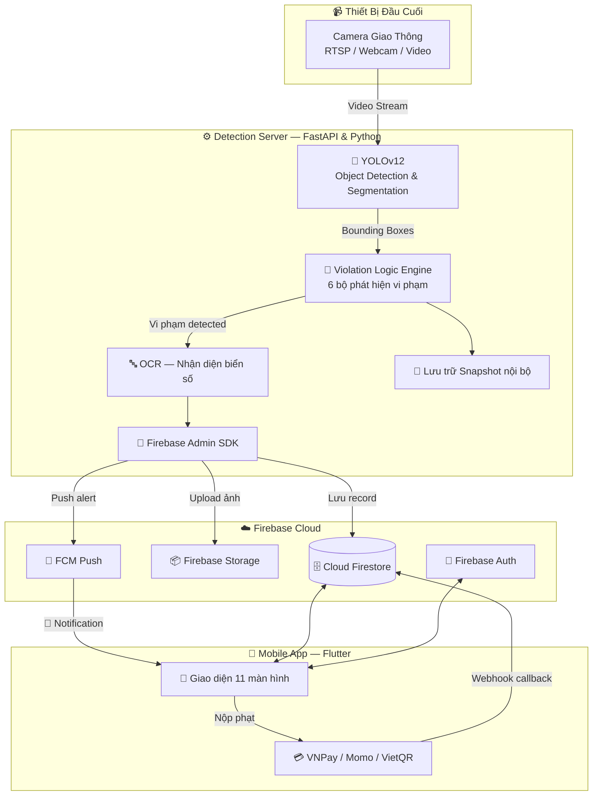
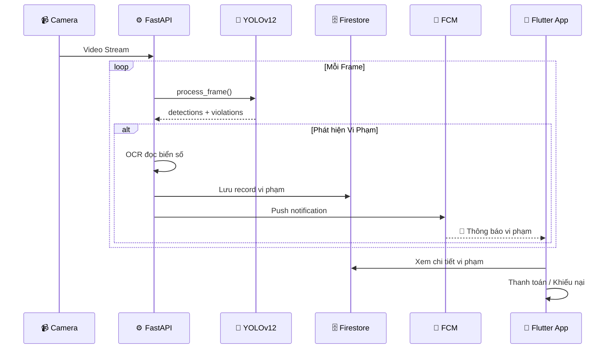

<div align="center">

# 🚦 VNeTraffic — Hệ Thống Phạt Nguội Giao Thông Thông Minh

### AI-Powered Traffic Violation Detection & Mobile Fine Payment System

[](https://python.org)
[](https://fastapi.tiangolo.com)
[](https://flutter.dev)
[](https://firebase.google.com)
[](#)
[](#)

<br/>

**VNeTraffic** là hệ thống **End-to-End** phát hiện vi phạm giao thông tự động bằng trí tuệ nhân tạo,  
kết hợp ứng dụng di động cho phép người dân tra cứu, thanh toán phạt trực tuyến và khiếu nại.

[Kiến Trúc](#-kiến-trúc-hệ-thống) · [Tính Năng](#-tính-năng-nổi-bật) · [Cài Đặt](#-cài-đặt--khởi-chạy) · [Demo](#-demo) · [Tài Liệu](#-tài-liệu)

</div>

---

## 📋 Mục Lục

- [Tổng Quan](#-tổng-quan)
- [Kiến Trúc Hệ Thống](#-kiến-trúc-hệ-thống)
- [Tính Năng Nổi Bật](#-tính-năng-nổi-bật)
- [Công Nghệ Sử Dụng](#-công-nghệ-sử-dụng)
- [Mô Hình AI — 40 Class YOLO](#-mô-hình-ai--40-class-yolo)
- [Cài Đặt & Khởi Chạy](#-cài-đặt--khởi-chạy)
- [Cấu Trúc Dự Án](#-cấu-trúc-dự-án)
- [Luồng Xử Lý Vi Phạm](#-luồng-xử-lý-vi-phạm)
- [Thanh Toán & Webhook](#-thanh-toán--webhook)
- [Deploy Tự Động (1-Click)](#-deploy-tự-động-1-click)
- [Tài Liệu](#-tài-liệu)

---

## 🎯 Tổng Quan

| Thành Phần | Công Nghệ | Mô Tả |
|:----------:|:----------:|:------:|
| 🖥️ **Backend Server** | Python · FastAPI · YOLOv12 | Xử lý video, phát hiện vi phạm real-time, API quản lý |
| 📱 **Mobile App** | Flutter · Dart | Tra cứu vi phạm, nộp phạt online, ví giấy tờ số |
| ☁️ **Cloud Services** | Firebase (Auth · Firestore · Storage · FCM) | Lưu trữ, xác thực, đồng bộ, push notification |
| 💳 **Thanh Toán** | VNPay · Momo · VietQR | Nộp phạt trực tuyến qua cổng thanh toán |

### Luồng hoạt động tổng quát

```
📹 Camera ➜ 🧠 YOLOv12 AI ➜ 🔍 Phát hiện vi phạm ➜ 📝 OCR biển số ➜ ☁️ Firebase ➜ 🔔 Push ➜ 📱 App
```

---

## 🏗 Kiến Trúc Hệ Thống



---

## ✨ Tính Năng Nổi Bật

### 🤖 Trí Tuệ Nhân Tạo (AI Detection)

| # | Loại Vi Phạm | Module | Mô Tả |
|:-:|:-------------|:------:|:-------|
| 1 | 🪖 Không đội mũ bảo hiểm | `helmet_violation.py` | Phát hiện người đi xe máy không đội MBH qua phân tích vùng đầu |
| 2 | 🔴 Vượt đèn đỏ | `redlight_violation.py` | Theo dõi trạng thái đèn + vị trí xe vượt vạch dừng |
| 3 | 🚶 Đi lên vỉa hè | `sidewalk_violation.py` | Phát hiện phương tiện xâm nhập vùng vỉa hè |
| 4 | ⬅️ Đi ngược chiều | `wrong_way_violation.py` | Phân tích hướng di chuyển so với luồng giao thông |
| 5 | 🛣️ Đi sai làn đường | `wrong_lane_violation.py` | Segmentation làn đường + kiểm tra vị trí phương tiện |
| 6 | 🚫 Vi phạm biển báo | `sign_violation.py` | Nhận diện biển báo cấm và phương tiện vi phạm |

- **Mô hình:** YOLOv12 custom-trained với **40 class** chuyên biệt cho giao thông Việt Nam
- **Tracking:** ByteTrack multi-object tracking liên tục qua các frame
- **Real-time:** Xử lý và phát hiện vi phạm theo thời gian thực qua WebSocket

### 📱 Ứng Dụng Di Động (Flutter App)

- **11 màn hình UI** hoàn chỉnh với giao diện Dark Mode hiện đại
- **Tra cứu vi phạm** theo biển số xe, xem chi tiết + ảnh bằng chứng
- **Thanh toán phạt trực tuyến** qua VNPay / Momo / VietQR
- **Ví giấy tờ số** — Lưu trữ CCCD, Giấy phép lái xe, hệ thống điểm bằng lái (12 điểm)
- **Khiếu nại (Appeal)** — Gửi yêu cầu phản đối vi phạm kèm bằng chứng
- **Push Notification real-time** qua FCM + WebSocket
- **OTA Update** — Tự động cập nhật phiên bản mới không cần Store
- **Đa ngôn ngữ** — Hỗ trợ Tiếng Việt & English

### 🖥️ Web Dashboard

- Giao diện quản lý phát hiện vi phạm
- Chọn video + model + loại vi phạm → Start Detection
- Xem kết quả detection real-time qua WebSocket streaming
- Hỗ trợ đa ngôn ngữ (i18n)

### 🚀 DevOps & Automation

- **1-Click Deploy** — Auto tìm IP, build APK, upload server
- **Auto Version Bump** — Tự động tăng version mỗi lần deploy
- **Ngrok Webhook** — Tunnel cho thanh toán callback
- **Firebase Rules** — Firestore & Storage security rules sẵn sàng

---

## 🛠 Công Nghệ Sử Dụng

<div align="center">

| Tầng | Công Nghệ | Chi Tiết |
|:-----|:----------|:---------|
| **AI / ML** | YOLOv12 · OpenCV · NumPy | Object detection, segmentation, tracking |
| **Backend** | FastAPI · Uvicorn · Python 3.10+ | REST API + WebSocket server |
| **Mobile** | Flutter 3.41+ · Dart 3.11+ | Cross-platform Android app |
| **Database** | Cloud Firestore | Real-time NoSQL database |
| **Storage** | Firebase Storage | Ảnh vi phạm, snapshot bằng chứng |
| **Auth** | Firebase Authentication | Email/Password authentication |
| **Push** | Firebase Cloud Messaging | Push notification Android/Web |
| **Payment** | VNPay · Momo · VietQR (SePay) | Thanh toán phạt trực tuyến |
| **Tracking** | ByteTrack (lapx) | Multi-object tracking |
| **DevOps** | Bash · PowerShell · Ngrok | CI/CD automation & tunneling |

</div>

---

## 🧠 Mô Hình AI — 40 Class YOLO

Mô hình YOLOv12 được huấn luyện riêng (custom-trained) với **40 class** đặc thù cho giao thông Việt Nam:

<details>
<summary><b>📋 Xem danh sách đầy đủ 40 class</b></summary>

| ID | Class | Mô Tả |
|:--:|:------|:-------|
| 0 | `ambulance` | Xe cứu thương |
| 1–5 | `arrow_left`, `arrow_right`, `arrow_straight`, `arrow_straight_and_left`, `arrow_straight_and_right` | Mũi tên chỉ hướng trên đường |
| 6 | `car` | Ô tô |
| 7–8 | `dashed_white_line`, `dashed_yellow_line` | Vạch kẻ đường nét đứt |
| 9 | `fire_truck` | Xe cứu hỏa |
| 10–19 | `light_left_green/red/yellow`, `light_right_green`, `light_straight_arrow_green/red/yellow`, `light_straight_circle_green/red/yellow` | Đèn giao thông (10 trạng thái) |
| 20 | `median` | Dải phân cách |
| 21 | `motorcycle` | Xe máy |
| 22 | `pedestrian_crossing` | Vạch sang đường |
| 23 | `person` | Người |
| 24 | `person_no_helmet` | Người không đội mũ bảo hiểm |
| 25 | `person_with_helmet` | Người đội mũ bảo hiểm |
| 26 | `police_car` | Xe cảnh sát |
| 27 | `sidewalk` | Vỉa hè |
| 28–36 | `sign_no_car`, `sign_no_entry`, `sign_no_left_and_return`, `sign_no_left_turn`, `sign_no_parking`, `sign_no_return`, `sign_no_right_and_return`, `sign_no_right_turn`, `sign_no_stopping` | Biển báo cấm (9 loại) |
| 37–38 | `solid_white_line`, `solid_yellow_line` | Vạch kẻ đường liền |
| 39 | `stop_line` | Vạch dừng |

</details>

---

## 🚀 Cài Đặt & Khởi Chạy

### Yêu Cầu Hệ Thống

| Thành Phần | Yêu Cầu |
|:-----------|:---------|
| **Python** | 3.10+ |
| **Flutter SDK** | 3.41+ |
| **CUDA** *(khuyến nghị)* | 11.8+ |
| **GPU** *(khuyến nghị)* | NVIDIA, VRAM ≥ 4GB |
| **RAM** | ≥ 8GB |
| **Java JDK** | 21+ |

### 1️⃣ Clone Repository

```bash
git clone https://github.com/khanhbes/Violation-Detect.git
cd Violation-Detect
```

### 2️⃣ Cài Đặt Backend (Python)

```bash
# Tạo môi trường ảo
python -m venv .venv

# Kích hoạt (Windows)
.venv\Scripts\activate

# Kích hoạt (Mac/Linux)
source .venv/bin/activate

# Cài đặt thư viện
pip install -r requirements.txt

# (Tùy chọn) Cài PyTorch với CUDA cho GPU
pip install torch torchvision --index-url https://download.pytorch.org/whl/cu118
```

### 3️⃣ Cấu Hình Firebase

1. Tạo project tại [Firebase Console](https://console.firebase.google.com)
2. Bật: **Authentication**, **Cloud Firestore**, **Firebase Storage**, **Cloud Messaging**
3. Tải `serviceAccountKey.json` → đặt vào `Detection Web/Web/`
4. Tải `google-services.json` → đặt vào `App/traffic_violation_app/android/app/`
5. Copy `firebase-config.example.js` → `firebase-config.js` trong `Detection Web/Web/static/`

### 4️⃣ Chuẩn Bị Model YOLO

Đặt file model `.pt` vào `Detection Web/assets/model/`:
- Model detection: `yolo26_rbf.pt` (40 class)
- Model segmentation: `yolov26s_seg.pt`

### 5️⃣ Khởi Chạy Server

```bash
# Cách 1: Chạy trực tiếp
cd "Detection Web/Web"
python app.py

# Cách 2: Chạy 1-Click (Windows)
START.bat
```

> 🌐 Server khởi chạy tại: **http://localhost:8000**

### 6️⃣ Khởi Chạy Mobile App

```bash
cd App/traffic_violation_app
flutter pub get
flutter run          # Debug mode
flutter build apk    # Build release
```

---

## 📁 Cấu Trúc Dự Án

```
Violation Detect/
│
├── Detection Web/                        # 🖥️ Backend + AI + Web Dashboard
│   ├── Web/
│   │   ├── app.py                       # FastAPI server chính
│   │   ├── services/
│   │   │   ├── detection_service.py     # UnifiedDetector (AI core)
│   │   │   └── fcm_service.py           # Firebase Cloud Messaging
│   │   ├── static/                      # Frontend (JS, CSS, icons)
│   │   └── templates/index.html         # Web Dashboard
│   │
│   ├── functions/                       # 🤖 6 Violation Detectors
│   │   ├── helmet_violation.py
│   │   ├── redlight_violation.py
│   │   ├── sidewalk_violation.py
│   │   ├── sign_violation.py
│   │   ├── wrong_lane_violation.py
│   │   └── wrong_way_violation.py
│   │
│   ├── config/                          # ⚙️ Cấu hình (40 YOLO classes)
│   ├── utils/                           # 🎨 Drawing utilities
│   └── assets/                          # Model weights + video test
│
├── App/
│   └── traffic_violation_app/           # 📱 Flutter Mobile App
│       └── lib/
│           ├── main.dart                # Entry point
│           ├── screens/                 # 11 màn hình UI
│           ├── services/                # 6 services
│           ├── models/                  # Data models
│           ├── theme/                   # Dark mode theme
│           └── widgets/                 # Reusable widgets
│
├── Project info/                        # 📄 Tài liệu & Kiến trúc
│
├── deploy.bat / deploy.sh               # 🚀 Auto deploy (1-Click)
├── START.bat                            # ▶️ Khởi động nhanh
├── Start_Webhook.bat                    # 💳 Ngrok webhook thanh toán
├── requirements.txt                     # Python dependencies
├── firebase.json                        # Firebase config
├── firestore.rules                      # Firestore security rules
└── storage.rules                        # Storage security rules
```

---

## 🔄 Luồng Xử Lý Vi Phạm



### Chi tiết từng bước:

1. **Thu thập** — Camera gửi video stream liên tục đến server
2. **Nhận diện AI** — YOLOv12 phân tích từng frame, trả về bounding box cho 40 class
3. **Đánh giá vi phạm** — 6 bộ detector kiểm tra các luật giao thông (đèn đỏ, MBH, làn đường...)
4. **OCR biển số** — Nhận diện biển số xe vi phạm để quy trách nhiệm
5. **Lưu bằng chứng** — Snapshot ảnh vi phạm → Firebase Storage, record → Firestore
6. **Cảnh báo** — FCM push notification + WebSocket real-time đến app người dùng
7. **Xử lý** — Người dân xem vi phạm, nộp phạt online hoặc gửi khiếu nại

---

## 💳 Thanh Toán & Webhook

Hệ thống tích hợp thanh toán trực tuyến qua **SePay** (VNPay / Momo / VietQR):

```bash
# Khởi động Ngrok tunnel cho webhook
Start_Webhook.bat
```

- **Webhook endpoint:** `/api/webhook/sepay`
- Khi thanh toán thành công → webhook tự động cập nhật trạng thái `"Đã thanh toán"` trên Firestore
- Người dùng cũng có thể gửi **Khiếu nại (Appeal)** → trạng thái bị khóa chờ Admin xử lý

---

## 🚀 Deploy Tự Động (1-Click)

```bash
# Windows
deploy.bat

# Mac/Linux
chmod +x deploy.sh && ./deploy.sh
```

Script tự động thực hiện:

| Bước | Hành Động |
|:----:|:----------|
| 1 | 🔍 Tìm IP WiFi/LAN hiện tại |
| 2 | 📝 Cập nhật IP vào `api_service.dart` |
| 3 | 🔢 Tự động tăng version trong `pubspec.yaml` |
| 4 | 📦 Build APK release |
| 5 | ☁️ Upload APK lên server → App nhận popup cập nhật (OTA) |

---

## 📚 Tài Liệu

| Tài Liệu | Mô Tả |
|:----------|:-------|
| [`HE_THONG_HOAT_DONG.md`](./HE_THONG_HOAT_DONG.md) | Sơ đồ khối, lưu đồ thuật toán, giải thích hệ thống chi tiết |
| [`HUONG_DAN_CHAY.md`](./HUONG_DAN_CHAY.md) | Hướng dẫn cài đặt & chạy chi tiết từng bước |
| [`Project info/architecture_diagram.md`](./Project%20info/architecture_diagram.md) | Sơ đồ kiến trúc Mermaid đầy đủ |
| [`Project info/Project_Overview.md`](./Project%20info/Project_Overview.md) | Tổng quan dự án & tính năng |

---

## ⚠️ Lưu Ý Bảo Mật

Các file sau **KHÔNG được commit** lên Git (đã cấu hình trong `.gitignore`):

```
🔒 serviceAccountKey.json      — Firebase Admin key
🔒 google-services.json        — Firebase Android config
🔒 firebase-config.js          — Firebase Web config
🔒 *.pt / *.onnx               — Model weights (23-60MB)
🔒 assets/video/               — Video test (~130MB)
```

---

<div align="center">

## 🤝 Đóng Góp

Mọi đóng góp đều được chào đón! Hãy tạo **Issue** hoặc **Pull Request** nếu bạn muốn cải thiện dự án.

---

**VNeTraffic** — *Giải pháp phạt nguội giao thông thông minh bằng AI cho Việt Nam* 🇻🇳

Made with ❤️ using YOLOv12 · FastAPI · Flutter · Firebase

</div>
