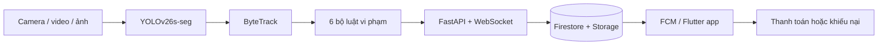

# VNeTraffic — AI Traffic Violation Detection

Hệ thống nghiên cứu phát hiện vi phạm giao thông Việt Nam bằng **instance segmentation**, **multi-object tracking** và các luật hình học có thể giải thích. Dự án gồm dashboard FastAPI dành cho người vận hành, backend Firebase và ứng dụng Android Flutter dành cho người tham gia giao thông.

[Project Showcase](https://khanhbes.github.io/projects/violation-detect/) · [Tính năng](#tính-năng-chính) · [Cài nhanh trên Windows](#cài-đặt-nhanh-trên-windows) · [Launcher](#launcher-thống-nhất) · [Xử lý lỗi](#xử-lý-lỗi-thường-gặp)

> Đây là research prototype, không phải hệ thống xử phạt đã được chứng nhận pháp lý. Kết quả AI cần được người có thẩm quyền kiểm tra trước khi sử dụng.

## Tổng quan

VNeTraffic xử lý một luồng dữ liệu khép kín:


```mermaid
flowchart LR
    A[Camera / video / ảnh] --> B[YOLOv26s-seg]
    B --> C[ByteTrack]
    C --> D[6 bộ luật vi phạm]
    D --> E[FastAPI + WebSocket]
    E --> F[(Firestore + Storage)]
    F --> G[FCM / Flutter app]
    G --> H[Thanh toán hoặc khiếu nại]
```

Mô hình nhận diện 40 lớp đối tượng. Kết quả segmentation và tracking được chuyển đến sáu module logic: không đội mũ bảo hiểm, vượt đèn đỏ, đi trên vỉa hè/dải phân cách, sai làn hoặc đè vạch, đi ngược chiều và vi phạm biển báo.

### Kết quả nghiên cứu

| Chỉ số | Kết quả |
|---|---:|
| Ảnh trong tập dữ liệu | 4.482 |
| Instance annotations | 47.039 |
| Số lớp đối tượng | 40 |
| Box mAP50 | 86,9% |
| Mask mAP50 | 85,5% |
| Inference trên NVIDIA A100 | 7,2 ms/ảnh, khoảng 139 FPS |
| Số epoch huấn luyện | 150 |

Chỉ số 7,2 ms chỉ đo inference của mô hình; độ trễ toàn hệ thống còn phụ thuộc giải mã video, tracking, mạng và lưu trữ.

## Giao diện

<p align="center">
  
</p>

| Phân tích ảnh | Phân tích thời gian thực |
|---|---|
|  |  |

<p align="center">
  
</p>

<p align="center">
  
</p>

Các ảnh ứng dụng trong README đã được thay dữ liệu định danh và thanh toán bằng dữ liệu demo trước khi công khai.

## Tính năng chính

### AI và dashboard vận hành

- Nhận nguồn từ ảnh, video, webcam hoặc RTSP.
- Instance segmentation và tracking nhiều đối tượng bằng YOLO + ByteTrack.
- Bật/tắt từng detector và điều chỉnh confidence trên dashboard.
- Phân tích video thời gian thực qua WebSocket.
- Lưu snapshot bằng chứng theo từng nhóm vi phạm.
- Quản lý người dùng, phương tiện, vi phạm, khiếu nại và bản phát hành APK.

### Ứng dụng Android Flutter

- Firebase Authentication và hồ sơ người dùng/phương tiện.
- Đồng bộ danh sách vi phạm từ Firestore và backend.
- Push notification bằng Firebase Cloud Messaging.
- Xem chi tiết và ảnh bằng chứng.
- Thanh toán VietQR/SePay và nhận trạng thái qua webhook.
- Gửi khiếu nại kèm ảnh hỗ trợ.
- Kiểm tra và tải bản APK mới từ backend.

## Yêu cầu hệ thống

### Bắt buộc để chạy backend

- Windows 10/11 64-bit.
- Python 3.10 trở lên. Python 3.11 hoặc 3.12 được khuyến nghị.
- Git. Cài Git LFS trước khi clone vì video mẫu được quản lý bằng LFS.
- Ít nhất 8 GB RAM và khoảng 4 GB dung lượng trống cho môi trường Python.

GPU NVIDIA/CUDA không bắt buộc. Backend có thể chạy CPU nhưng xử lý video sẽ chậm hơn đáng kể.

### Bổ sung để chạy/build ứng dụng

- Flutter SDK 3.x.
- Android Studio, Android SDK và một emulator hoặc điện thoại Android đã bật USB debugging.
- Java/JDK theo phiên bản Flutter hiện tại; `flutter doctor` sẽ chỉ ra thành phần còn thiếu.

### Tùy chọn

- Tài khoản Firebase để dùng đăng nhập, Firestore, Storage và FCM.
- Ngrok để nhận webhook từ Internet. Repo có sẵn `ngrok_bin/ngrok.exe`; người dùng vẫn cần cấu hình auth token của tài khoản ngrok.
- Node.js và Firebase CLI nếu muốn deploy security rules.

## Cài đặt nhanh trên Windows

### 1. Clone repository

```powershell
git lfs install
git clone https://github.com/khanhbes/Violation-Detect.git
cd "Violation-Detect"
git lfs pull
```

Nếu đã tải repo dạng ZIP, hãy giải nén vào đường dẫn ngắn, không chứa ký tự đặc biệt. Git clone vẫn được khuyến nghị để tải đúng file LFS.

### 2. Mở launcher

Nhấp đúp [`START.bat`](./START.bat), hoặc chạy:

```powershell
powershell -NoProfile -ExecutionPolicy Bypass -File .\VNeTraffic.ps1
```

Chọn lần lượt:

1. **Cài đặt backend** — tạo `.venv` và cài dependencies.
2. **Kiểm tra môi trường** — xác nhận Python, model, video, Flutter và Firebase.
3. **Chạy server Web + AI** hoặc mục 4 nếu chưa muốn dùng Ngrok.

Sau khi server báo sẵn sàng, mở [http://localhost:8000](http://localhost:8000).

### 3. Lần chạy đầu tiên nên không dùng Ngrok

```powershell
.\VNeTraffic.ps1 -Action server -SkipNgrok
```

Dashboard vẫn chạy nếu chưa cấu hình Firebase; các chức năng đăng nhập, Firestore, Storage và push notification sẽ không hoạt động cho đến khi thêm credential.

## Launcher thống nhất

Repo chỉ duy trì một script PowerShell: [`VNeTraffic.ps1`](./VNeTraffic.ps1). `START.bat` là wrapper nhỏ để người dùng Windows mở menu bằng cách nhấp đúp.

### Menu

| Lựa chọn | Chức năng | Thay đổi file? |
|---:|---|---|
| 1 | Tạo `.venv`, nâng cấp pip và cài `requirements.txt` | Có, chỉ trong `.venv` |
| 2 | Kiểm tra môi trường và import Python | Không |
| 3 | Chạy FastAPI cùng Ngrok | Không |
| 4 | Chạy FastAPI nội bộ, không Ngrok | Không |
| 5 | Chạy riêng Ngrok tunnel | Không |
| 6 | Chạy Flutter trên device/emulator | Có thể sinh build cache |
| 7 | Build APK release | Sinh thư mục `build/` |
| 8 | Cập nhật IP, tăng version, build và upload APK | Có, sửa Dart và `pubspec.yaml` |
| 9 | Deploy Firestore + Storage rules | Thay đổi cấu hình Firebase cloud |

### Chạy trực tiếp bằng tham số

```powershell
# Hiện tất cả câu lệnh
.\VNeTraffic.ps1 -Action help

# Cài backend
.\VNeTraffic.ps1 -Action setup

# Tạo lại hoàn toàn .venv nếu môi trường cũ bị hỏng
.\VNeTraffic.ps1 -Action setup -ResetVenv

# Kiểm tra môi trường
.\VNeTraffic.ps1 -Action check

# Chạy server local không mở tunnel
.\VNeTraffic.ps1 -Action server -SkipNgrok

# Chạy trên port khác
.\VNeTraffic.ps1 -Action server -Port 8080 -SkipNgrok

# Chạy Flutter trên device cụ thể
.\VNeTraffic.ps1 -Action app -Device emulator-5554

# Chỉ build APK
.\VNeTraffic.ps1 -Action build-apk

# Tăng version, build và upload APK lên backend đang chạy
.\VNeTraffic.ps1 -Action deploy-apk -Changelog "Sửa lỗi thông báo"

# Bắt buộc người dùng cập nhật bản mới
.\VNeTraffic.ps1 -Action deploy-apk -Changelog "Bản cập nhật bắt buộc" -ForceUpdate
```

Nếu PowerShell chặn script, không cần thay đổi policy toàn hệ thống. Dùng câu lệnh có `-ExecutionPolicy Bypass`:

```powershell
powershell -NoProfile -ExecutionPolicy Bypass -File .\VNeTraffic.ps1 -Action check
```

## Cấu hình Firebase

Firebase là tùy chọn cho demo AI local nhưng bắt buộc cho đầy đủ tài khoản, dữ liệu, ảnh và notification.

### Backend Admin SDK

1. Mở Firebase Console → **Project settings** → **Service accounts**.
2. Chọn **Generate new private key**.
3. Đổi tên file thành `serviceAccountKey.json`.
4. Đặt tại:

```text
Detection Web/Web/serviceAccountKey.json
```

Không commit file này. `.gitignore` đã loại trừ `serviceAccountKey.json`.

### Web dashboard Firebase client

```powershell
Copy-Item `
  ".\Detection Web\Web\static\firebase-config.example.js" `
  ".\Detection Web\Web\static\firebase-config.js"
```

Mở `firebase-config.js` và điền cấu hình Web App từ Firebase Console. File thật đã được ignore; chỉ file `.example.js` được commit.

### Android Firebase

Tải `google-services.json` của Android app và đặt tại:

```text
App/traffic_violation_app/android/app/google-services.json
```

Sau đó chạy lại:

```powershell
cd .\App\traffic_violation_app
flutter clean
flutter pub get
cd ..\..
```

### Deploy security rules

```powershell
npm install -g firebase-tools
firebase login
firebase use --add
.\VNeTraffic.ps1 -Action firebase
```

Launcher deploy cả `firestore.rules` và `storage.rules` theo [`firebase.json`](./firebase.json).

## Chạy ứng dụng Android

### 1. Kiểm tra Flutter

```powershell
flutter doctor
flutter devices
```

Giải quyết các mục có dấu đỏ trong `flutter doctor`, sau đó:

```powershell
.\VNeTraffic.ps1 -Action app
```

Nếu có nhiều thiết bị:

```powershell
.\VNeTraffic.ps1 -Action app -Device <device-id>
```

### 2. Kết nối app với backend

- Điện thoại và máy chạy backend phải cùng mạng LAN/Wi-Fi.
- Không dùng `localhost` trên điện thoại; `localhost` khi đó là chính điện thoại.
- IP server mặc định nằm trong `App/traffic_violation_app/lib/services/api_service.dart`.
- Người dùng có thể đổi IP/port trong phần cài đặt ứng dụng.
- Workflow `deploy-apk` tự tìm IPv4 LAN và cập nhật `serverIp` trước khi build.

Nếu dùng Android emulator mặc định, host thường có thể truy cập qua `10.0.2.2:8000`. Nếu dùng máy thật, dùng IPv4 của máy tính, ví dụ `192.168.1.10:8000`.

### 3. Build APK release

```powershell
.\VNeTraffic.ps1 -Action build-apk
```

APK được tạo tại:

```text
App/traffic_violation_app/build/app/outputs/flutter-apk/app-release.apk
```

## Ngrok và webhook SePay

### Cấu hình lần đầu

```powershell
.\ngrok_bin\ngrok.exe config add-authtoken <NGROK_AUTH_TOKEN>
```

### Mở tunnel riêng

Giữ backend chạy ở một cửa sổ, mở cửa sổ PowerShell thứ hai:

```powershell
.\VNeTraffic.ps1 -Action ngrok -Port 8000
```

Webhook SePay cần trỏ tới:

```text
https://<ngrok-domain>/api/webhook/sepay
```

Nếu tài khoản có reserved domain:

```powershell
.\VNeTraffic.ps1 -Action ngrok -NgrokDomain <domain>.ngrok-free.app
```

Không đưa auth token, API key hoặc credential vào README, source code hay commit Git.

## Chạy thủ công không qua launcher

Launcher là cách khuyến nghị. Các lệnh tương đương dưới đây hữu ích khi debug:

```powershell
# Backend
python -m venv .venv
.\.venv\Scripts\python.exe -m pip install -r requirements.txt
$env:VNETRAFFIC_ENABLE_NGROK = "0"
.\.venv\Scripts\python.exe ".\Detection Web\Web\app.py"
```

```powershell
# Flutter
cd .\App\traffic_violation_app
flutter pub get
flutter run
```

Các biến môi trường backend hỗ trợ:

| Biến | Mặc định | Ý nghĩa |
|---|---:|---|
| `VNETRAFFIC_PORT` | `8000` | Port HTTP/WebSocket |
| `VNETRAFFIC_ENABLE_NGROK` | `1` | Đặt `0` để không tự chạy Ngrok |
| `FIREBASE_CREDENTIALS` | rỗng | Đường dẫn khác tới service-account JSON |
| `CLEANUP_SNAPSHOTS_ON_STARTUP` | `0` | Đặt `1` để xóa snapshot cũ khi server khởi động |

## API và địa chỉ quan trọng

| Thành phần | Địa chỉ mặc định |
|---|---|
| Dashboard | `http://localhost:8000` |
| OpenAPI docs | `http://localhost:8000/docs` |
| App WebSocket | `ws://<server-ip>:8000/ws/app` |
| Admin WebSocket | `ws://<server-ip>:8000/ws/admin` |
| App stats | `GET /api/app/stats` |
| Bản app mới nhất | `GET /api/app/latest-version` |
| Upload APK | `POST /api/app/upload-apk` |
| SePay webhook | `POST /api/webhook/sepay` |

## Cấu trúc repository

```text
Violation-Detect/
├── VNeTraffic.ps1                  # Launcher duy nhất: setup/run/build/deploy
├── START.bat                       # Mở menu launcher trên Windows
├── requirements.txt                # Python dependencies
├── Detection Web/
│   ├── config/                     # Model, tracker và ngưỡng phát hiện
│   ├── functions/                  # 6 nhóm logic vi phạm
│   ├── utils/                      # Vẽ kết quả và lưu bằng chứng
│   ├── assets/
│   │   ├── model/                  # Model YOLO
│   │   └── video/                  # Video mẫu
│   └── Web/
│       ├── app.py                  # FastAPI entry point
│       ├── services/               # Detection và Firebase/FCM
│       ├── templates/              # Dashboard HTML
│       ├── static/                 # CSS, JavaScript và icon
│       └── apk_releases/           # APK mới nhất cho OTA update
├── App/traffic_violation_app/
│   ├── lib/                        # Flutter application source
│   ├── android/                    # Android runner/configuration
│   ├── test/                       # Flutter tests
│   └── pubspec.yaml                # Flutter dependencies/version
├── Project info/
│   ├── KH.NC.SV.25_56.pdf          # Báo cáo nghiên cứu
│   ├── poster.pdf                  # Poster nghiên cứu
│   ├── class_index.txt             # Danh sách class của model
│   └── code_train.txt              # Mã tham khảo huấn luyện
├── docs/images/                    # Ảnh minh họa cho README
├── firebase.json
├── firestore.rules
└── storage.rules
```

Repo tập trung vào backend và Android. Các runner Flutter iOS, web và desktop không được lưu vì chưa thuộc phạm vi phát hành; có thể tái tạo bằng `flutter create .` nếu dự án mở rộng nền tảng sau này.

## Kiểm tra chất lượng

```powershell
# Kiểm tra toàn bộ môi trường
.\VNeTraffic.ps1 -Action check

# Kiểm tra cú pháp Python
.\.venv\Scripts\python.exe -m py_compile `
  ".\Detection Web\Web\app.py" `
  ".\Detection Web\Web\services\detection_service.py" `
  ".\Detection Web\Web\services\fcm_service.py"

# Phân tích Flutter mà không tải package lại
cd .\App\traffic_violation_app
flutter analyze --no-pub
flutter test --no-pub
```

## Xử lý lỗi thường gặp

### PowerShell báo “running scripts is disabled”

```powershell
powershell -NoProfile -ExecutionPolicy Bypass -File .\VNeTraffic.ps1
```

### `ModuleNotFoundError`

Đảm bảo đang dùng Python trong `.venv`, sau đó cài lại:

```powershell
.\VNeTraffic.ps1 -Action setup
```

Nếu pip hoặc `.venv` bị hỏng, tạo lại môi trường sạch:

```powershell
.\VNeTraffic.ps1 -Action setup -ResetVenv
```

### Không tìm thấy model hoặc video

```powershell
git lfs pull
.\VNeTraffic.ps1 -Action check
```

Model mặc định là `Detection Web/assets/model/yolo26_rbf.pt`; video mặc định là `Detection Web/assets/video/test_2_fixed.mp4`.

### CUDA không khả dụng

Kiểm tra:

```powershell
.\.venv\Scripts\python.exe -c "import torch; print(torch.__version__); print('CUDA:', torch.cuda.is_available())"
```

CPU vẫn chạy được. Nếu cần GPU, cài đúng bản PyTorch tương ứng với driver/CUDA từ hướng dẫn chính thức của PyTorch rồi chạy lại kiểm tra.

### Điện thoại không kết nối được backend

1. Xác nhận backend mở bằng trình duyệt trên máy tính.
2. Truy cập `http://<server-ip>:8000/api/app/stats` từ trình duyệt điện thoại.
3. Cho phép Python qua Windows Firewall trên mạng Private.
4. Đảm bảo hai thiết bị cùng Wi-Fi và router không bật client isolation.
5. Kiểm tra IP/port trong phần cài đặt của app.

### Firebase bị `PERMISSION_DENIED`

- Xác nhận ứng dụng đang dùng đúng Firebase project.
- Kiểm tra `serviceAccountKey.json` và `google-services.json` thuộc cùng project.
- Deploy lại rules bằng `VNeTraffic.ps1 -Action firebase`.
- Không sửa rules thành chế độ public để né lỗi xác thực.

### Ngrok không tạo tunnel

```powershell
.\ngrok_bin\ngrok.exe config check
.\ngrok_bin\ngrok.exe http 8000
```

Kiểm tra auth token, kết nối Internet và bảo đảm không có tiến trình Ngrok khác giữ cùng domain.

### Build APK thất bại

```powershell
flutter doctor
cd .\App\traffic_violation_app
flutter clean
flutter pub get
flutter build apk --release
```

## Bảo mật và dữ liệu

Các file sau đã được `.gitignore` bảo vệ và không được commit:

- `.env`
- `serviceAccountKey.json`
- `google-services.json`
- `GoogleService-Info.plist`
- `firebase-config.js`
- output, upload, snapshot và build cache

Nếu một credential từng bị commit, việc xóa file ở commit mới là chưa đủ; hãy thu hồi/rotate credential trong Firebase, ngrok hoặc nhà cung cấp tương ứng.

## Tài liệu nghiên cứu

- [Báo cáo KH.NC.SV.25_56](./Project%20info/KH.NC.SV.25_56.pdf)
- [Poster nghiên cứu](./Project%20info/poster.pdf)
- [Danh sách 40 class](./Project%20info/class_index.txt)
- [Mã tham khảo huấn luyện](./Project%20info/code_train.txt)

## License và đóng góp

Repository hiện chưa khai báo license mã nguồn mở. Bạn có thể đọc và chạy phục vụ học tập/nghiên cứu; không nên mặc định rằng mã nguồn được phép sử dụng thương mại hoặc phân phối lại.

Khi đóng góp, không commit dữ liệu cá nhân, credential Firebase, ảnh biển số thật chưa ẩn danh hoặc output model dung lượng lớn. Hãy chạy kiểm tra Python và Flutter trước khi tạo pull request.
