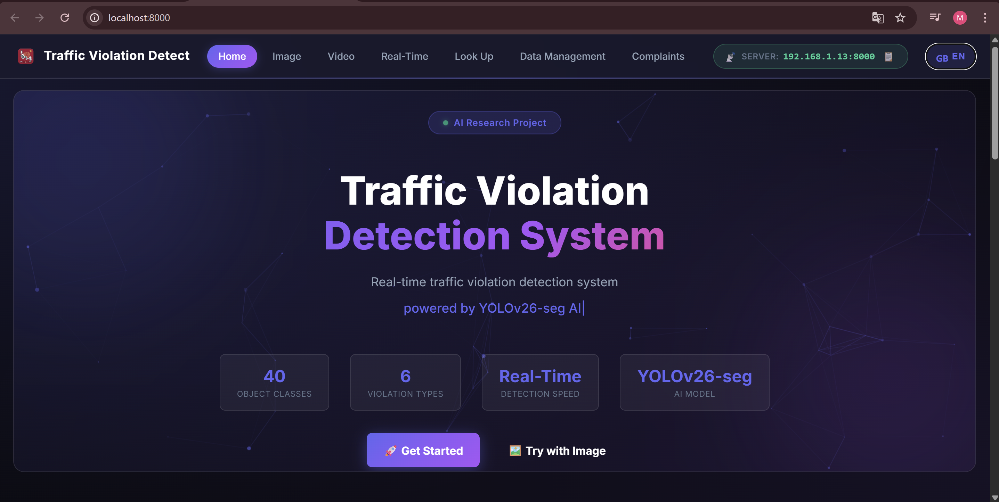
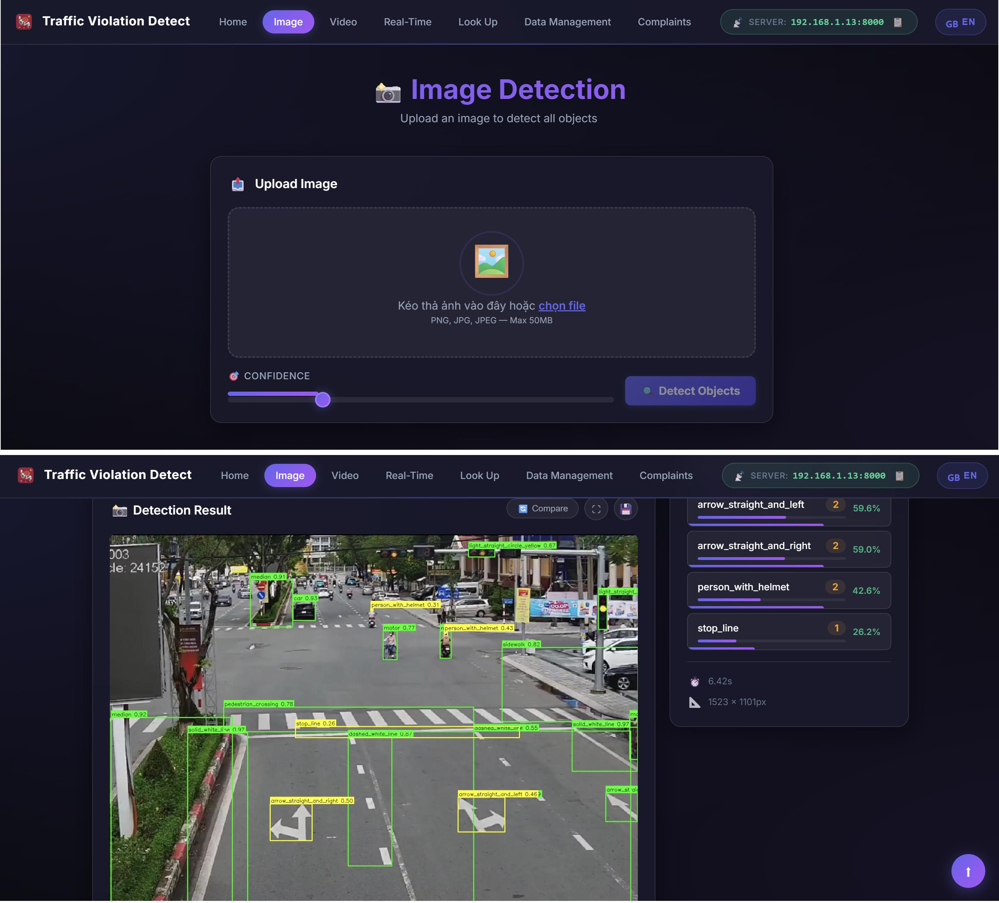
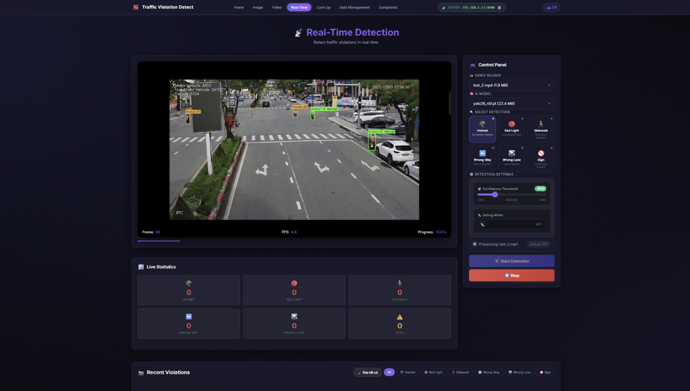
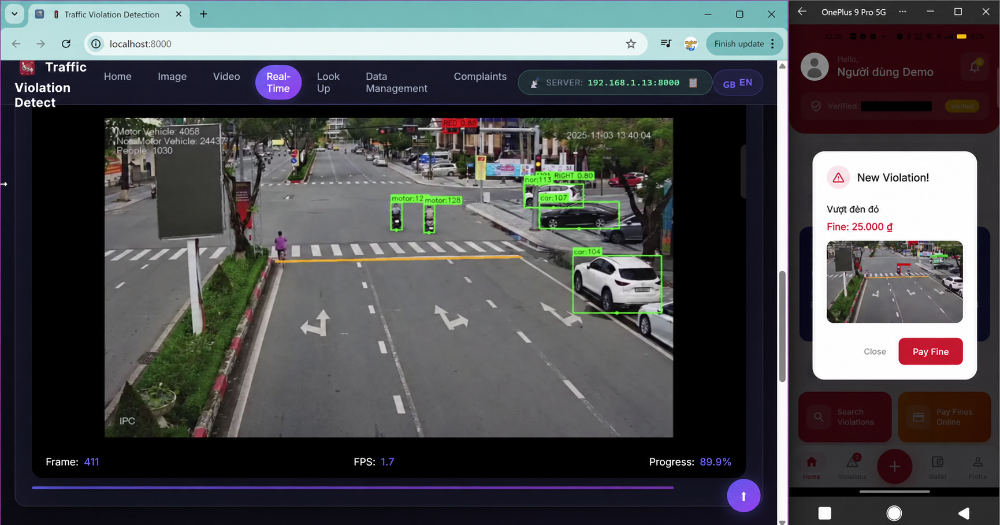
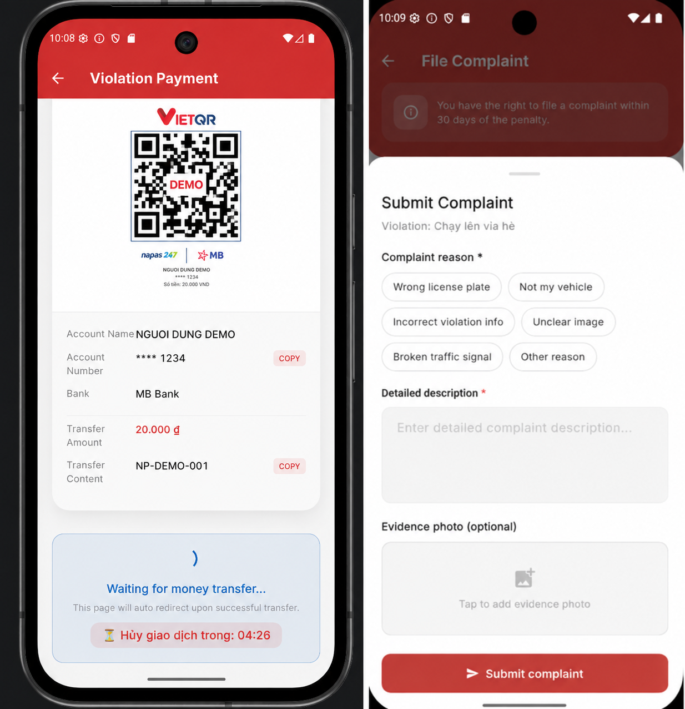
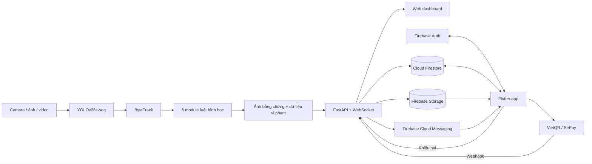

<div align="center">


# VNeTraffic

### Hệ thống phát hiện vi phạm giao thông và hỗ trợ xử lý phạt nguội

[](https://www.python.org/)
[](https://fastapi.tiangolo.com/)
[](https://flutter.dev/)
[](https://firebase.google.com/)
[](#mô-hình-ai-và-kết-quả-nghiên-cứu)

**VNeTraffic** là nguyên mẫu end-to-end kết hợp thị giác máy tính, web dashboard và ứng dụng Flutter để phát hiện, lưu bằng chứng, thông báo, tra cứu, thanh toán và tiếp nhận khiếu nại vi phạm giao thông.

[Demo](#demo-giao-diện) · [Tính năng](#tính-năng-chính) · [Kiến trúc](#kiến-trúc-hệ-thống) · [Cài đặt](#cài-đặt-và-khởi-chạy) · [Tài liệu](#tài-liệu)

</div>

---

## Demo giao diện

### Web dashboard

Giao diện web là trung tâm thử nghiệm và vận hành: nhận ảnh/video, lựa chọn mô hình và bộ luật vi phạm, theo dõi kết quả real-time, lưu bằng chứng và quản trị dữ liệu.

<p align="center">
  
  <br />
  <sub>Trang chủ hệ thống giám sát vi phạm giao thông.</sub>
</p>

<table>
  <tr>
    <td width="50%" align="center">
      
      <br /><sub>Upload ảnh, điều chỉnh confidence và xem kết quả segmentation.</sub>
    </td>
    <td width="50%" align="center">
      
      <br /><sub>Phân tích video thời gian thực với 6 bộ phát hiện vi phạm.</sub>
    </td>
  </tr>
</table>

### Web và ứng dụng di động

<p align="center">
  
  <br />
  <sub>Vi phạm từ dashboard được đồng bộ và cảnh báo trên ứng dụng.</sub>
</p>

<p align="center">
  
  <br />
  <sub>Thanh toán bằng VietQR và gửi khiếu nại kèm ảnh bằng chứng.</sub>
</p>

> Các ảnh demo được trích từ Chương 6 — *System Implementation* của báo cáo [`KH.NC.SV.25_56.pdf`](./Project%20info/KH.NC.SV.25_56.pdf). Thông tin định danh và thanh toán trong ảnh app đã được thay bằng dữ liệu demo trước khi công khai.

---

## Tổng quan

| Thành phần | Công nghệ | Vai trò |
|---|---|---|
| AI & xử lý video | YOLOv26s-seg, OpenCV, NumPy | Detection, instance segmentation và phân tích hành vi |
| Tracking | ByteTrack; OC-SORT là phương án thay thế trong nghiên cứu | Duy trì định danh phương tiện qua nhiều frame |
| Backend | Python, FastAPI, WebSocket | API, xử lý media và truyền kết quả thời gian thực |
| Web dashboard | HTML, CSS, JavaScript, Jinja2 | Thử nghiệm mô hình, giám sát và quản trị |
| Mobile app | Flutter, Dart | Tra cứu, thông báo, thanh toán và khiếu nại |
| Cloud | Firebase Auth, Firestore, Storage, FCM | Xác thực, đồng bộ dữ liệu, lưu bằng chứng và push notification |
| Thanh toán | VietQR/SePay; luồng mở rộng VNPay, MoMo | Đối soát và cập nhật trạng thái nộp phạt qua webhook |

## Tính năng chính

### Phát hiện vi phạm bằng AI

- Nhận diện và phân đoạn 40 lớp đối tượng đặc thù cho giao thông Việt Nam.
- Hỗ trợ ảnh, video và luồng phân tích thời gian thực qua WebSocket.
- Hiển thị bounding box, segmentation mask, nhãn, confidence và track ID.
- Tự động hiệu chỉnh các vùng hình học như vạch dừng, làn đường và vỉa hè.
- Lưu frame bằng chứng, thông tin vi phạm và dữ liệu liên quan lên Firebase.

Sáu module luật hiện có:

| Loại vi phạm | Module | Nguyên tắc xử lý |
|---|---|---|
| Không đội mũ bảo hiểm | `helmet_violation.py` | Liên kết người, vùng đầu và xe máy |
| Vượt đèn đỏ | `redlight_violation.py` | Trạng thái đèn, vạch dừng và quỹ đạo xe |
| Đi lên vỉa hè/dải phân cách | `sidewalk_violation.py` | Giao cắt giữa phương tiện và vùng cấm |
| Đi ngược chiều | `wrong_way_violation.py` | Hướng chuyển động theo lịch sử tracking |
| Sai làn/đè vạch | `wrong_lane_violation.py` | Mask làn đường, vạch kẻ và vị trí phương tiện |
| Vi phạm biển báo | `sign_violation.py` | Biển cấm, vùng hiệu lực và hướng di chuyển |

### Web dashboard

- Điều hướng riêng cho ảnh, video, real-time, tra cứu, quản lý dữ liệu và khiếu nại.
- Chọn model, detector và ngưỡng confidence trực tiếp trên giao diện.
- Thống kê phiên xử lý và danh sách vi phạm gần nhất.
- Quản lý người dùng, phương tiện, điểm giấy phép lái xe và lịch sử xử lý.
- Tiếp nhận, đối chiếu bằng chứng, chấp thuận hoặc từ chối khiếu nại.
- Theo dõi hạn mức thao tác Firestore và đồng bộ thay đổi qua kênh admin WebSocket.

### Ứng dụng Flutter

- Đăng ký/đăng nhập bằng Firebase Authentication.
- Quản lý hồ sơ, CCCD, phương tiện và điểm giấy phép lái xe.
- Nhận vi phạm mới qua FCM và WebSocket; xem ảnh bằng chứng và chi tiết mức phạt.
- Lọc danh sách vi phạm theo trạng thái chưa nộp/đã nộp.
- Thanh toán bằng QR và cập nhật trạng thái tự động qua webhook.
- Gửi khiếu nại với lý do, mô tả và ảnh bằng chứng.
- Nhận thông báo kết quả xử lý khiếu nại.
- Kiểm tra và tải bản APK cập nhật theo cơ chế OTA nội bộ.

## Mô hình AI và kết quả nghiên cứu

Theo báo cáo nghiên cứu đi kèm, mô hình được huấn luyện 150 epoch trên NVIDIA A100 với bộ dữ liệu giao thông Việt Nam tự xây dựng:

| Chỉ số | Kết quả báo cáo |
|---|---:|
| Ảnh gốc | 4.482 |
| Instance annotations | 47.039 |
| Số lớp | 40 |
| mAP50 — bounding box | 86,9% |
| mAP50 — segmentation mask | 85,5% |
| Inference latency | 7,2 ms/ảnh |
| Inference throughput | ~139 FPS trên NVIDIA A100 |

> FPS trên chỉ phản ánh thời gian inference của mô hình trong môi trường thử nghiệm; tốc độ end-to-end còn phụ thuộc phần cứng, độ phân giải, tracking, logic vi phạm, truyền dữ liệu và lưu trữ.

<details>
<summary><strong>Danh sách 40 lớp của mô hình</strong></summary>

| Nhóm | ID | Lớp |
|---|---:|---|
| Xe ưu tiên & phương tiện | 0, 6, 9, 21, 26 | `ambulance`, `car`, `fire_truck`, `motorcycle`, `police_car` |
| Mũi tên chỉ hướng | 1–5 | `arrow_left`, `arrow_right`, `arrow_straight`, `arrow_straight_and_left`, `arrow_straight_and_right` |
| Vạch kẻ đường | 7–8, 37–39 | `dashed_white_line`, `dashed_yellow_line`, `solid_white_line`, `solid_yellow_line`, `stop_line` |
| Đèn tín hiệu | 10–19 | Đèn trái/phải/đi thẳng theo trạng thái đỏ, vàng, xanh |
| Hạ tầng | 20, 22, 27 | `median`, `pedestrian_crossing`, `sidewalk` |
| Người tham gia giao thông | 23–25 | `person`, `person_no_helmet`, `person_with_helmet` |
| Biển báo cấm | 28–36 | 9 lớp biển cấm ô tô, cấm đi vào, cấm rẽ/quay đầu, cấm đỗ/dừng |

</details>

## Kiến trúc hệ thống


```mermaid
flowchart LR
    CAM[Camera / ảnh / video] --> AI[YOLOv26s-seg]
    AI --> TRACK[ByteTrack]
    TRACK --> RULES[6 module luật hình học]
    RULES --> EVIDENCE[Ảnh bằng chứng + dữ liệu vi phạm]

    EVIDENCE --> API[FastAPI + WebSocket]
    API --> WEB[Web dashboard]
    API --> STORE[(Firebase Storage)]
    API --> DB[(Cloud Firestore)]
    API --> FCM[Firebase Cloud Messaging]

    AUTH[Firebase Auth] <--> APP[Flutter app]
    DB <--> APP
    STORE --> APP
    FCM --> APP
    APP --> PAY[VietQR / SePay]
    PAY -->|Webhook| API
    APP -->|Khiếu nại| API
```

### Luồng xử lý một vi phạm

1. Camera, ảnh hoặc video được gửi đến backend.
2. YOLOv26s-seg trả về bounding box và mask; ByteTrack duy trì ID đối tượng.
3. Module tương ứng áp dụng các điều kiện hình học có thể kiểm tra lại.
4. Khi đủ điều kiện xác nhận, hệ thống đóng băng frame và tạo bản ghi bằng chứng.
5. Backend lưu ảnh lên Storage, metadata lên Firestore và gửi thông báo đến đúng người dùng.
6. Người dùng xem chi tiết, thanh toán hoặc gửi khiếu nại trên app.
7. Webhook thanh toán hoặc quyết định của quản trị viên cập nhật trạng thái và đồng bộ ngược về app.

## Cài đặt và khởi chạy

### Yêu cầu

| Thành phần | Phiên bản/ghi chú |
|---|---|
| Python | 3.10 trở lên |
| Flutter | 3.x; Dart SDK `>=3.0.0 <4.0.0` |
| Java | JDK 21 trở lên để build Android |
| RAM | Tối thiểu 8 GB |
| GPU | NVIDIA VRAM từ 4 GB được khuyến nghị; vẫn có thể chạy CPU với tốc độ thấp hơn |
| Firebase | Auth, Firestore, Storage và Cloud Messaging |

### 1. Cài backend

```powershell
git clone https://github.com/khanhbes/Violation-Detect.git
cd "Violation-Detect"

python -m venv .venv
.\.venv\Scripts\Activate.ps1
pip install -r requirements.txt
pip install fastapi uvicorn jinja2 python-multipart pyyaml websockets requests
```

Nếu sử dụng GPU, cài PyTorch phù hợp với phiên bản CUDA trên máy theo hướng dẫn chính thức của PyTorch.

### 2. Chuẩn bị model và Firebase

```text
Detection Web/assets/model/yolo26_rbf.pt
Detection Web/assets/model/yolov26s_seg.pt
Detection Web/Web/serviceAccountKey.json
Detection Web/Web/static/firebase-config.js
App/traffic_violation_app/android/app/google-services.json
```

Tạo `firebase-config.js` từ [`firebase-config.example.js`](./Detection%20Web/Web/static/firebase-config.example.js), sau đó điền cấu hình Web App của Firebase. Không commit các khóa bí mật vào Git.

### 3. Chạy web dashboard

Cách nhanh trên Windows:

```powershell
.\START.bat
```

Hoặc chạy trực tiếp:

```powershell
.\.venv\Scripts\python.exe "Detection Web\Web\app.py"
```

Mở [http://localhost:8000](http://localhost:8000). Khi Firebase chưa sẵn sàng, phần AI cục bộ vẫn có thể được kiểm tra nhưng các chức năng đồng bộ cloud, quản trị và thông báo sẽ bị giới hạn.

### 4. Chạy ứng dụng Flutter

```powershell
cd "App\traffic_violation_app"
flutter pub get
flutter run
```

Build APK release:

```powershell
flutter build apk --release
```

### 5. Kiểm tra chất lượng

```powershell
# Python
python -m py_compile "Detection Web\Web\app.py"

# Flutter
cd "App\traffic_violation_app"
flutter analyze
flutter test
```

## API và kênh thời gian thực

Một số endpoint quan trọng:

| Endpoint | Chức năng |
|---|---|
| `GET /api/videos` | Danh sách video thử nghiệm |
| `GET /api/models` | Danh sách model khả dụng |
| `GET /api/detectors` | Danh sách module vi phạm |
| `POST /api/detect/image` | Nhận diện ảnh |
| `POST /api/detect/video` | Khởi tạo xử lý video |
| `GET /api/app/violations` | Danh sách vi phạm theo người dùng |
| `POST /api/app/complaints/submit` | Gửi khiếu nại |
| `POST /api/webhook/sepay` | Nhận callback thanh toán |
| `WS /ws/app` | Cập nhật real-time cho ứng dụng |
| `WS /ws/admin` | Cập nhật real-time cho dashboard quản trị |

## Cấu trúc repository

```text
Violation Detect/
├── Detection Web/
│   ├── Web/
│   │   ├── app.py                    # FastAPI, REST API và WebSocket
│   │   ├── services/                 # AI orchestration và FCM
│   │   ├── static/                   # CSS, JavaScript, icon, Firebase config
│   │   └── templates/index.html      # Web dashboard
│   ├── functions/                    # 6 module phát hiện vi phạm
│   ├── config/                       # Model, tracker và ngưỡng xử lý
│   └── assets/                       # Model và video thử nghiệm (không commit)
├── App/traffic_violation_app/
│   ├── lib/screens/                  # Các màn hình Flutter
│   ├── lib/services/                 # Auth, API, Firestore, FCM, OTA
│   ├── lib/models/                   # Mô hình dữ liệu
│   └── android/                      # Cấu hình Android
├── docs/images/                      # Ảnh minh họa dùng trong README
├── Project info/                     # Ghi chú kỹ thuật và kiến trúc
│   └── KH.NC.SV.25_56.pdf            # Báo cáo nghiên cứu
├── START.bat                         # Khởi động backend trên Windows
├── deploy.bat / deploy.sh            # Build và phát hành APK nội bộ
├── firestore.rules / storage.rules   # Quy tắc bảo mật Firebase
└── requirements.txt                  # Phụ thuộc AI/Python cốt lõi
```

## Deploy APK nội bộ

```powershell
.\deploy.bat
```

Quy trình deploy tự động phát hiện IP LAN, cập nhật endpoint của app, tăng version/build number, build APK và đưa bản phát hành vào `Detection Web/Web/apk_releases/` để ứng dụng kiểm tra cập nhật OTA.

## Bảo mật và dữ liệu nhạy cảm

Các tệp sau đã được loại khỏi Git và không được chia sẻ công khai:

- `serviceAccountKey.json`
- `google-services.json`
- `GoogleService-Info.plist`
- `firebase-config.js`
- `.env`
- model `*.pt`, `*.onnx`
- video thử nghiệm và ảnh bằng chứng sinh ra trong quá trình chạy

Nên sử dụng Firebase Security Rules theo nguyên tắc quyền tối thiểu, xác minh chữ ký webhook thanh toán và chỉ triển khai backend qua HTTPS trong môi trường thực tế.

## Phạm vi nghiên cứu

Đây là nguyên mẫu nghiên cứu. Báo cáo ghi nhận một số giới hạn cần cân nhắc trước khi triển khai thực địa: tập kiểm thử của một số module còn nhỏ, dữ liệu tập trung chủ yếu tại Hà Nội, và đánh giá quy mô lớn với nhiều luồng RTSP chưa nằm trong phạm vi thử nghiệm. Kết quả AI không nên được dùng làm quyết định xử phạt cuối cùng nếu chưa có quy trình kiểm duyệt, hiệu chuẩn camera và cơ chế đối soát pháp lý phù hợp.

## Tài liệu

| Tài liệu | Nội dung |
|---|---|
| [`KH.NC.SV.25_56.pdf`](./Project%20info/KH.NC.SV.25_56.pdf) | Báo cáo nghiên cứu, phương pháp, đánh giá và giao diện hệ thống |
| [`HE_THONG_HOAT_DONG.md`](./HE_THONG_HOAT_DONG.md) | Sơ đồ khối và mô tả luồng hoạt động |
| [`HUONG_DAN_CHAY.md`](./HUONG_DAN_CHAY.md) | Hướng dẫn cài đặt và xử lý lỗi chi tiết |
| [`Project info/architecture_diagram.md`](./Project%20info/architecture_diagram.md) | Sơ đồ kiến trúc mở rộng |
| [`Project info/Project_Overview.md`](./Project%20info/Project_Overview.md) | Tổng quan thành phần và quy trình triển khai |

---

<div align="center">

**VNeTraffic — Computer vision for transparent traffic enforcement**

Phát triển phục vụ mục đích nghiên cứu khoa học và thử nghiệm kỹ thuật.

</div>
